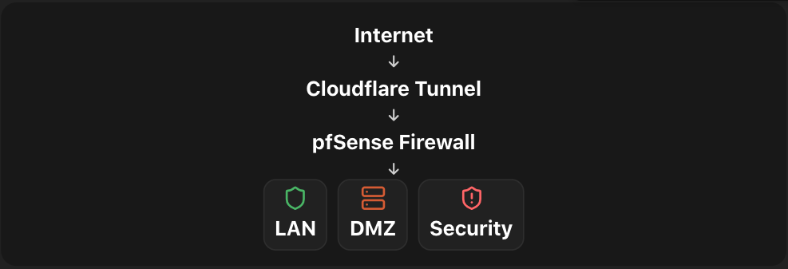
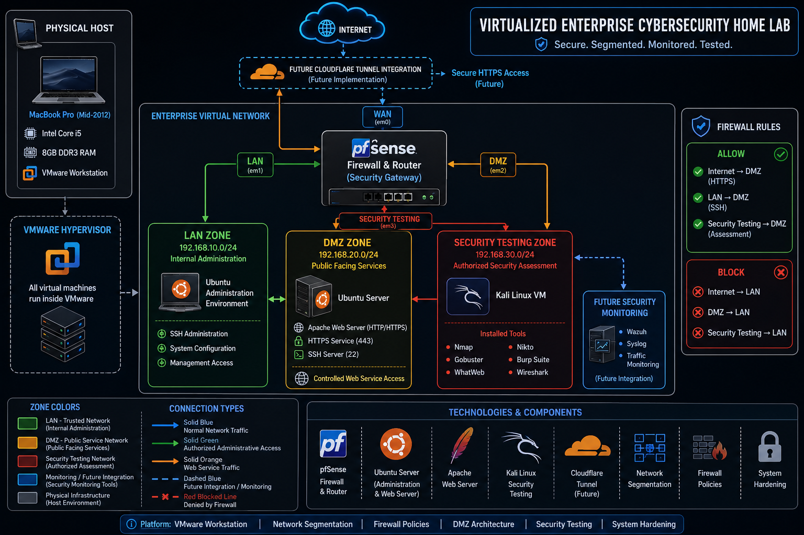

# 🔐 Enterprise Cybersecurity Home Lab

## 🚀 Project Status

✅ Completed

---

## 📌 Overview

A virtualized enterprise cybersecurity home lab built using VMware to simulate a secure corporate network environment.

This project demonstrates:

* 🏢 Enterprise network architecture
* 🔥 Firewall segmentation using pfSense
* 🐧 Ubuntu server deployment
* 🔐 SSH hardening
* 🌐 Apache web server security
* 🕵️ Authorized vulnerability assessment
* 📄 Security documentation

---

# 🎯 Objectives

* Design an enterprise-style network architecture
* Implement LAN, DMZ, and Security Testing zones
* Configure pfSense as the firewall gateway
* Deploy a secure Ubuntu Apache Web Server
* Perform vulnerability assessment using Kali Linux
* Apply security hardening and validate improvements

---

# 🏗️ Lab Architecture

# High-Level Architecture

The high-level architecture provides an overview of the enterprise network and illustrates how external users securely access the web server through Cloudflare Tunnel while pfSense protects and segments the internal network.



# Detailed Architecture

The detailed architecture illustrates the complete virtual infrastructure, including virtualization, network segmentation, firewall rules, virtual machines, and authorized security testing paths.

<p align="center">

</p>

## Environment

| System           | Purpose            | IP Address    |
| ---------------- | ------------------ | ------------- |
| 🔥 pfSense       | Firewall & Gateway | -             |
| 🐧 Ubuntu Server | Apache Web Server  | 192.168.10.50 |
| 🐉 Kali Linux    | Security Testing   | 192.168.30.50 |

---

# 🌐 Network Segmentation

## 🟢 LAN Zone

**Subnet:**

```
192.168.10.0/24
```

Purpose:

* Administration
* SSH management
* Server configuration

---

## 🟡 DMZ Zone

**Subnet:**

```
192.168.20.0/24
```

Purpose:

* Public-facing services
* Isolated web server environment

Services:

* Apache Web Server
* Cloudflare Tunnel (Future)

---

## 🔴 Security Testing Zone

**Subnet:**

```
192.168.30.0/24
```

Purpose:

* Authorized penetration testing
* Vulnerability assessment

Tools:

* Nmap
* Gobuster
* Nikto
* WhatWeb
* Burp Suite
* Wireshark

---

# 🔥 Firewall Design

pfSense controls communication between network zones.

## Allowed Traffic

✅ LAN → DMZ
✅ Security Testing → DMZ
✅ Internet → Web Services

## Blocked Traffic

❌ Internet → LAN
❌ DMZ → LAN
❌ Security Testing → LAN

---

# 🛠️ Completed Phases

## ✅ Phase 1 — Architecture Design

Completed:

* Enterprise network planning
* Security zone design
* VMware topology setup

---

## ✅ Phase 2 — pfSense Firewall Deployment

Completed:

* Firewall installation
* Network segmentation
* Traffic control policies

---

## ✅ Phase 3 — Ubuntu Server Setup

Completed:

* Ubuntu deployment
* Network configuration
* Apache installation

---

## ✅ Phase 4 — SSH Hardening

Implemented:

🔒 Security improvements:

* Disabled insecure root access
* Hardened SSH configuration
* Verified secure access

---

## ✅ Phase 5 — Web Server Security Assessment

### 🔎 Security Testing

Performed using Kali Linux:

Tools:

* Nmap
* Curl
* WhatWeb
* Gobuster
* Nikto

### 🔧 Apache Hardening

Implemented:

✅ ServerTokens Prod
✅ ServerSignature Off
✅ Security Headers:

* X-Content-Type-Options
* X-Frame-Options
* Referrer-Policy

✅ Disabled Apache Status Module

### 📊 Validation

Before vs After testing performed:

* Reduced information disclosure
* Improved HTTP security headers
* Verified configuration changes

---

# 📸 Project Evidence

Screenshots included:

```
screenshots/

├── Network Setup
├── pfSense Configuration
├── SSH Hardening
├── Apache Hardening
├── Security Testing
└── Final Validation
```

---

# 🚀 Future Enhancements

Planned:

* ☁️ Cloudflare Tunnel Integration
* 🛡️ Wazuh Security Monitoring
* 📊 SIEM Dashboard
* 🚨 IDS / IPS Implementation
* 🔐 VPN Remote Access
* 📡 Network Traffic Analysis

---

# 🧰 Technologies Used

| Category         | Technology                     |
| ---------------- | ------------------------------ |
| Virtualization   | VMware Workstation             |
| Firewall         | pfSense                        |
| Server           | Ubuntu                         |
| Security Testing | Kali Linux                     |
| Web Server       | Apache                         |
| Network Analysis | Wireshark                      |
| Assessment Tools | Nmap, Nikto, Gobuster, WhatWeb |

---

# 🧠 Skills Demonstrated

* Network Security
* Firewall Configuration
* Linux Administration
* Web Server Hardening
* Vulnerability Assessment
* Penetration Testing
* Security Documentation
* Troubleshooting

---

# 📚 Lessons Learned

Through this project, I gained hands-on experience with:

* Building enterprise-style virtual networks
* Understanding firewall segmentation
* Securing Linux services
* Performing security assessments
* Validating vulnerabilities manually
* Documenting security improvements

---

⭐ Built as a practical cybersecurity learning project.

---
<p align="center">

</p>


