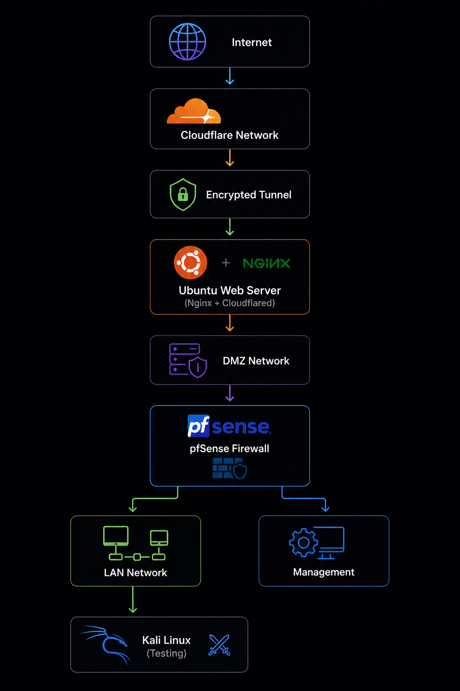

# 🔐 Secure Web Server with Cloudflare Tunnel

## 🚀 Project Status

🚧 In Progress

---

# 📌 Overview

A secure web server deployment project built using VMware virtualization to demonstrate modern web infrastructure security and secure remote access using Cloudflare Tunnel.

This project focuses on hosting a web service without exposing the internal server directly to the public internet through traditional port forwarding methods.

This project demonstrates:

- 🌐 Secure web server deployment
- ☁️ Cloudflare Tunnel integration
- 🔒 Zero Trust remote access architecture
- 🐧 Linux server administration
- 🔥 Firewall-controlled network access
- 🛡️ Web server security hardening
- 🕵️ Authorized vulnerability assessment
- 📄 Security documentation

---

# 🎯 Objectives

- Deploy a secure Ubuntu Server web hosting environment
- Configure Nginx as the web server platform
- Implement Cloudflare Tunnel for secure external connectivity
- Prevent direct exposure of internal services
- Configure firewall-based network protection
- Apply Linux and web server security hardening
- Perform vulnerability assessment using Kali Linux
- Document security improvements and validation results

---

# 🏗️ Lab Architecture

## High-Level Architecture

Overview of the secure web hosting design showing Cloudflare Tunnel connectivity, firewall protection, web server deployment, and security testing environment.

**High-Level Architecture**

<p align="center">

</p>

---

# Environment

| System | Purpose | IP Address |
|---|---|---|
| 🔥 pfSense | Firewall & Network Gateway | - |
| 🐧 Ubuntu Server | Nginx Web Server + Cloudflared | TBD |
| 🐉 Kali Linux | Security Testing | TBD |
| ☁️ Cloudflare Tunnel | Secure External Access | External |

---

# 🌐 Network Design

## 🟡 DMZ Zone

Subnet:

```
192.168.20.0/24
```

Purpose:

- Public-facing web service environment
- Isolated server deployment
- Controlled external communication

Services:

- Nginx Web Server
- Cloudflare Tunnel Connector

---

## 🔴 Security Testing Zone

Subnet:

```
192.168.30.0/24
```

Purpose:

- Authorized security testing
- Vulnerability assessment
- Web application security validation

Tools:

- Nmap
- Gobuster
- Nikto
- WhatWeb
- Burp Suite
- Wireshark

---

# ☁️ Cloudflare Tunnel Architecture

Traditional web exposure:

```
Internet
    |
    |
Port Forwarding
    |
    |
Internal Web Server
```

Secure approach:

```
Internet
    |
    |
Cloudflare Network
    |
    |
Encrypted Tunnel
    |
    |
Cloudflared Connector
    |
    |
Ubuntu Web Server
```

Benefits:

✅ No inbound port forwarding  
✅ Hidden origin server  
✅ Encrypted communication  
✅ Zero Trust access model  

---

# 🔥 Firewall Design

pfSense controls communication between network zones.

## Allowed Traffic

✅ Ubuntu Server → Cloudflare  
(Outbound tunnel connection)

✅ LAN → Ubuntu Server  
(Server administration)

✅ Security Testing → Ubuntu Server  
(Authorized vulnerability assessment)

---

## Blocked Traffic

❌ Internet → Internal Server Direct Access

❌ Internet → LAN

❌ Web Server → Internal Network

---

# 🛠️ Implementation Phases

## ⏳ Phase 1 — Architecture Design

Completed:

- Project planning
- Network topology design
- VM resource allocation
- Security architecture planning

---

## ⏳ Phase 2 — Ubuntu Server Deployment

Completed:

- Ubuntu Server installation
- Network configuration
- Server preparation

---

## ⏳ Phase 3 — Nginx Web Server Setup

Planned:

- Install Nginx
- Configure web service
- Deploy test webpage
- Verify HTTP connectivity

---

## ⏳ Phase 4 — Cloudflare Tunnel Integration

Planned:

- Install Cloudflared connector
- Create Cloudflare Tunnel
- Configure DNS routing
- Validate secure remote access

---

## ⏳ Phase 5 — Web Server Hardening

Planned:

Security improvements:

✅ SSH hardening  
✅ Firewall configuration  
✅ Nginx security configuration  
✅ HTTP security headers  
✅ Service exposure review  

---

## ⏳ Phase 6 — Security Assessment

Testing performed using Kali Linux:

Tools:

- Nmap
- Nikto
- Gobuster
- WhatWeb
- Burp Suite

Validation:

- Service exposure analysis
- Web server security testing
- Configuration verification

---

# 📸 Project Evidence

Screenshots included:

```
├── diagrams/
│   └── secure-web-server-cloudflare-tunnel-architecture.png
│
├── images/
│   ├── phase-01/
│   ├── phase-02/
│   ├── phase-03/
│   ├── phase-04/
│   └── phase-05/
```

---

# 🚀 Future Enhancements

Planned:

- 🛡️ Web Application Firewall (WAF)
- 📊 Web server log monitoring
- 🚨 IDS / IPS integration
- 🔐 Access control policies
- 📈 Security monitoring dashboard
- 🔎 Automated vulnerability scanning

---

# 🧰 Technologies Used

| Category | Technology |
|---|---|
| Virtualization | VMware Workstation |
| Firewall | pfSense CE |
| Server | Ubuntu Server |
| Web Server | Nginx |
| Secure Access | Cloudflare Tunnel |
| Security Testing | Kali Linux |
| Assessment Tools | Nmap, Nikto, Gobuster, WhatWeb |

---

# 🧠 Skills Demonstrated

- Linux Server Administration
- Web Server Deployment
- Cloud Security Concepts
- Zero Trust Architecture
- Firewall Configuration
- Network Security
- Vulnerability Assessment
- Security Documentation
- Troubleshooting

---

# 📚 Lessons Learned

Through this project, I gained hands-on experience with:

- Deploying secure web infrastructure
- Understanding Zero Trust access architecture
- Protecting services without direct exposure
- Configuring secure remote connectivity
- Hardening Linux-based web servers
- Performing web security assessments

---

⭐ Built as a practical cybersecurity infrastructure learning project.

---

<p align="center">

</p>
